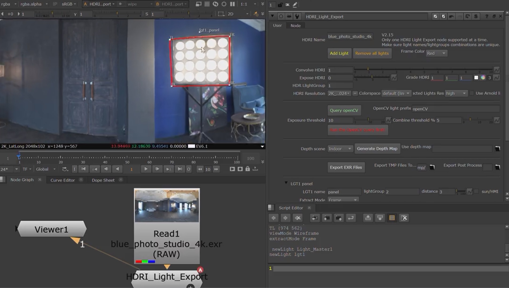

# HDRI Light Export

**Version 2.15** | Author: Daniele Tosti | 2026-03 | Foundry Nuke custom toolset for extracting individual light sources from HDRI lat-long images.

This tool isolates bright areas of an HDRI into separate EXR textures with per-light metadata (EV, LUX, 3D position, distance, scale). 
It supports manual frame framing, OpenCV auto-detection, and optional Depth Anything V2 metric depth for automatic distance estimation.

This project is source-available under a custom license. Commercial resale, relicensing, or redistribution as a paid standalone product is not permitted

NOTE that this GitHub repo only hosts the Gaffer and Blender importer demo. 
The actual .nuke folder is [hosted here for download](https://dtosti.com/HLE/HLE_20260321.tar). 

[Download the Nuke demo video](./VIDEOs/20260319_0935_HDRI_Light_Export_compressed.mp4)

[Download the Gaffer demo video](./VIDEOs/20260319_1005_HDRI_Light_Export_Gaffer_compressed.mp4)

---

## Workflow

1. **Create the node** — From the Nuke menu bar: *HLE tool > HDRI Light Export LOCAL*.
2. **Connect an HDRI** — Pipe a Read node (lat-long EXR/HDR) into the HDRI_Light_Export input.
3. **Add lights** — Use *Add Light* for manual placement, or *Query OpenCV* + *Build* for automatic detection.
4. **Adjust light frames** — Drag frame handles in the viewer to tune framing of each light area.
5. **(Optional) Generate Depth Map** — Select Indoor or Outdoor, then press *Generate Depth Map*. At export time, each light's distance and sun/HMI flag will be set from the depth map automatically.
6. **Export** — Press *Export EXR Files*. Output goes to the *Export TMP Files To* directory.
7. **(Optional) Post Process** — If an executable or script is set in *Export Post Process*, it runs after export with all output paths as arguments.

---

## UI Controls

### Header

| Control | Description |
|---|---|
| **HDRI Name** | Auto-populated from the upstream Read node filename. Used in metadata. |
| **Add Light** | Creates a new light group with framing. Prompts for a name. |
| **Remove all lights** | Deletes every light group and its knobs from the node. |
| **Frame Color** | Overlay color for all frames in the viewer: Red, Yellow, Purple, Green, Cyan. |

### Image Adjustments

| Control | Description |
|---|---|
| **Convolve HDRI** | Blur radius applied to the HDRI before light extraction (default 1). |
| **Expose HDRI** | Exposure adjustment in stops (range -5 to +5). |
| **Grade HDRI** | Per-channel RGB grade multiplier. |
| **HDR LightGroup** | Base lightgroup number for Gaffer integration. Each light adds its index. |
| **HDRI Resolution** | Output resolution of the clean HDRI write (linked to Reformat2). |
| **Colorspace** | Output colorspace for the clean HDRI write node. |
| **Extracted Lights Res** | Resolution of individual light texture crops: *default* or *high*. |
| **Use Arnold lights** | When enabled, exported metadata targets Arnold light conventions. |

### OpenCV Auto-Detection

| Control | Description |
|---|---|
| **Query OpenCV** | Analyzes the HDRI with the current threshold settings and reports how many light areas were found. Does not create lights. |
| **OpenCV light prefix** | Name prefix for auto-created lights (default: `openCV`). |
| **Exposure threshold** | Luminance value above which pixels are considered bright (range 1-20, default 10). |
| **Combine threshold %** | Distance threshold for merging nearby bright areas into a single light (range 0-20%, default 5%). |
| **Build N lights** (button label updates after query) | Creates light groups from the detected areas. Run the query first. |

### Depth Mapping (Optional)

| Control | Description |
|---|---|
| **Depth scene** | Selects which Depth Anything V2 metric model to use. *Indoor* (default): NYU Depth V2, max ~20m. *Outdoor*: Virtual KITTI 2, max ~80m. Match this to your scene type. |
| **Generate Depth Map** | Runs Depth Anything V2 metric inference on the upstream HDRI. Writes a 32-bit EXR with depth in meters. Auto-populates *Use depth map*. Disabled if onnxruntime or models are missing. |
| **Use depth map** | Path to a depth EXR (metric, meters). Can be typed manually or auto-filled by generation. When set, export automatically overrides each light's distance and sun/HMI flag based on the sampled depth at that light's center. Lights beyond 28m or with max luminance >= 20,000 are flagged as sun/HMI. |

### Export

| Control | Description |
|---|---|
| **Export EXR Files** | Renders all light crops and the clean HDRI to disk. Resolves metadata (EV, LUX, position, distance, scale) for each light. |
| **Export TMP Files To** | Output directory for all exported files (default `/tmp/`). |
| **Export Post Process** | Path to a `.py` or `.exe` to run after export. Receives all output EXR paths as command-line arguments. |

### Per-Light Controls (added dynamically)

Each light gets a collapsible tab with these controls:

| Control | Description |
|---|---|
| **LGT*N* name** | Editable light name. Must be unique. Used in filenames and metadata. |
| **lightGroup** | Lightgroup number for this light. |
| **distance** | Distance from HDRI center in meters (default 3). Overridden by depth map at export. |
| **sun/HMI** | When checked, the light is treated as infinitely far (directional). Auto-set when depth >= 28m or max luminance >= 20,000. |
| **Extract Mode** | *Frame*: extracts the light area as a flat perspective crop defined by the four frame handles, using a 3D scanline render. Best for well-defined rectangular light sources. *Normalized*: reprojects the selected region through an orthographic spherical (fisheye) reprojection based on the bounding box of the pins. Better for broad or irregularly shaped light areas. Both modes use the same frame handles as a controller. Linked from Light_Master. |
| **View Mode** | *Wireframe* or *Light Remove Patch*. Linked from Light_Master. |
| **Bottom left / Top left / Bottom right / Top right** | Frame coordinates. Linked to the internal light group's pin handles. |
| **size** | Computed output size (read-only). |
| **3D pos** | Computed 3D position in lat-long space (read-only). |
| **maxLuma / EV / LUX** | Computed at export time (read-only). |
| **Remove** | Deletes this light group and all its knobs. |

---

## Environment and Dependencies

### Core: `vendor/`

OpenCV and NumPy are pre-bundled under `vendor/` for multiple Nuke Python versions:

- `vendor/win_amd64_cp310/` — Windows, Python 3.10
- `vendor/win_amd64_cp311/` — Windows, Python 3.11
- `vendor/linux_x86_64_cp310/` — Linux, Python 3.10
- `vendor/linux_x86_64_cp311/` — Linux, Python 3.11

At startup, `__init__.py` detects the current platform and Python version, then inserts the matching vendor directory into `sys.path`. This makes `cv2` and `numpy` available to Nuke without any user-side pip install.

### Depth Mapping: `depthanything_env/`

A separate Python venv providing `onnxruntime` for depth inference. At import time, `HLE_main.py` adds the venv's `site-packages` to `sys.path`:

- **Windows**: `depthanything_env/Lib/site-packages`
- **Linux**: `depthanything_env/lib/pythonX.Y/site-packages`

This makes `onnxruntime` importable inside Nuke's Python without affecting the rest of the environment.

ONNX model files live under `depthanything_env/model/`:

- `depth_anything_v2_vitb_indoor_dynamic.onnx` (371 MB)
- `depth_anything_v2_vitb_outdoor_dynamic.onnx` (371 MB)

If onnxruntime or the model files are missing, the *Generate Depth Map* button is disabled. The rest of the tool works normally.

---

## Features

- **Single node**: Only one HDRI_Light_Export node is supported per Nuke script.
- **Depth model domain**: The indoor model overestimates distances outdoors and vice versa. Always match the *Depth scene* dropdown to the actual scene type.
- **Depth sun threshold**: Lights with sampled depth >= 28 meters or max luminance >= 20,000 are automatically flagged as sun/HMI.

---

## Troubleshooting

| Symptom | Cause / Fix |
|---|---|
| *Generate Depth Map* button is disabled | `onnxruntime` not importable or ONNX model files missing. Check the Nuke Script Editor for diagnostic prints at startup. Verify `depthanything_env/` setup. |
| All lights get the same distance | The depth map may not be loaded into the internal DepthMapRead node. Ensure the *Use depth map* field points to a valid EXR. Re-generate if needed. |
| Depth distances feel too high/low | Wrong model variant. Switch *Depth scene* between Indoor and Outdoor and re-generate. Indoor max ~20m, Outdoor max ~80m. |
| "I'm already executing something" popup | A known Nuke callback conflict. Fixed in v2.15. If it persists, avoid changing the *Use depth map* field while another operation is running. |
| OpenCV / NumPy not found | Vendor directory may be missing or not matching your Nuke Python version. Check `__init__.py` startup prints. Re-run `python vendor/populate_vendor.py` if needed. |
| "Please remove any other existing HDRI Light Export nodes" | Delete the existing HDRI_Light_Export node before creating a new one. |

---

## Non-Resale Software License

Copyright (c) 2021-2026 Daniele Tosti. All rights reserved.

Permission is hereby granted, free of charge or for a fee, to any person or
organization obtaining a copy of this software and associated documentation
files (the "Software"), to use, copy, modify, and distribute the Software,
including for internal commercial and production use, subject to the following
conditions:

1. **Attribution**
All copies or substantial portions of the Software, whether modified or
unmodified, must retain this copyright notice, this permission notice, and
identification of Daniele Tosti as the original author.

2. **No Resale or Standalone Commercial Distribution**
The Software may not be sold, sublicensed, relicensed, or redistributed as a
standalone commercial product, or as a substantial or primary component of a
paid product, service, or offering, without prior written permission from
Daniele Tosti.

Use of the Software in internal studio pipelines, production
environments, or client work is permitted, provided the Software itself is not
being sold, licensed, or marketed as the product or a paid feature.

3. **Third-Party Rights and Compliance**
You are solely responsible for ensuring that your use of the Software complies
with all applicable laws, regulations, and third-party rights, including but
not limited to software license terms, intellectual property rights, and any
rights associated with input images, HDRIs, exported data, or external tools
used with the Software.

4. **No Warranty**
THE SOFTWARE IS PROVIDED "AS IS", WITHOUT WARRANTY OF ANY KIND, EXPRESS OR
IMPLIED, INCLUDING BUT NOT LIMITED TO THE WARRANTIES OF MERCHANTABILITY,
FITNESS FOR A PARTICULAR PURPOSE, TITLE, AND NONINFRINGEMENT.

5. **Limitation of Liability**
IN NO EVENT SHALL THE AUTHOR OR COPYRIGHT HOLDER BE LIABLE FOR ANY CLAIM,
DAMAGES, OR OTHER LIABILITY, WHETHER IN AN ACTION OF CONTRACT, TORT, OR
OTHERWISE, ARISING FROM, OUT OF, OR IN CONNECTION WITH THE SOFTWARE OR THE USE
OR OTHER DEALINGS IN THE SOFTWARE.

6. **Termination**
Any rights granted under this license automatically terminate if you fail to
comply with its terms.
